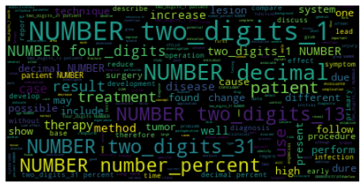
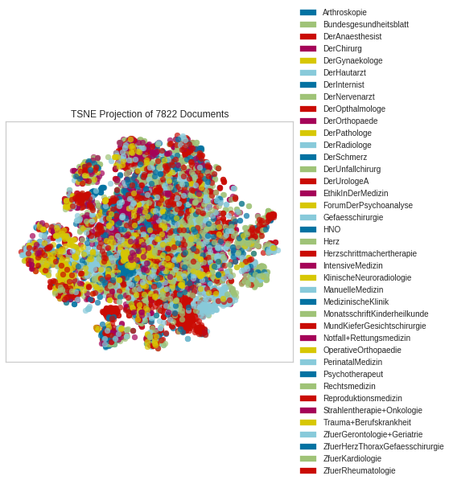
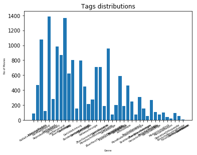

Construction du corpus
======================
- XML Parser, select lemma, select concpet's codes

Corpus discovery
==========================
- Word cloud

- T-SNE

- Class repartition (chart bar)

- Lexical richness measures

Préparation des données
=======================
- Tokenization (Deja lemmatisé dans le dataset brut)
- Suppression des stopwords (les stops word sont tous les termes qui ne figurent pas dans la liste de vocabulaire médical)

Resources
=========
 - Biomedical vocabulary used in addition to stop word list, all word not in vocabulary are removed
    
BioMedical vocabulary
===================
l'idée est de garder que les tremes médicaux qui ont un réel impact sur la classification de l'abstract
Il s'agit d'une simple liste de termes médicaux anglais formatés sous la forme d'un fichier texte codé en UTF8. Il est basé sur deux projets de dictionnaire médical de premier plan:
    1. OpenMedSpel par e-MedTools
    2. Raj & Co-Med-Spel-Chek par Rajasekharan N. de Raj & Co
https://github.com/glutanimate/wordlist-medicalterms-en

Représentation des mots
=======================
- word embedding (not tested beacause of my machine perfomance)
- tf-idf
- bag of word

Interprétation des résultats d'Apprentissage
============================================

Modèles utilisés pour la classification de texte (multiclasse)
    - SVC
    - SVC linéaire
    - Naive Bayes MultinomialNB

Validation du modèle
    - validation en 85% train et 15% test 
    - validation croisée
    
Résultats
    
    Accuracy score cross validation (SVC - Multi-class classifier one-vs-one) 
    [0.6079182630906769, 0.5849297573435505, 0.5843989769820972, 0.59846547314578, 0.6010230179028133, 0.5613810741687979, 0.5895140664961637, 0.6010230179028133, 0.6061381074168798, 0.5818414322250639]
    Accuracy score cross validation (SVC - Multi-class classifier one-vs-the-rest)
    [0.5938697318007663, 0.5721583652618135, 0.5946291560102301, 0.5997442455242967, 0.6202046035805626, 0.5485933503836317, 0.6035805626598465, 0.5959079283887468, 0.5971867007672634, 0.5882352941176471]

Interprétation

La répartition des classes est déséquilibrée, par conséquent le modèle a appris sur quelques classes qui sont représentées  
par plusieurs intances, le modèle n'a pas été capable d'apprendre sur les classes sous représentée

    
    